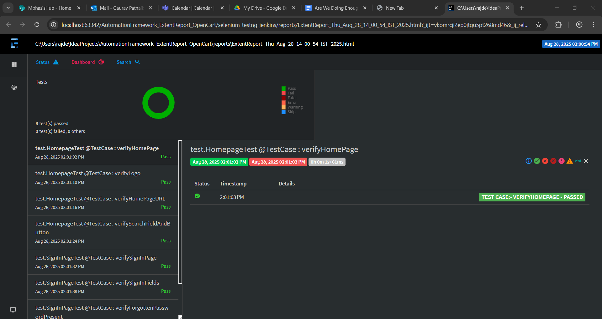

# Selenium TestNG Project with jenkins

This is a demo project for Selenium Page Object Model with Extent reporting ans Jenkins setup.

### Pre-requisites
* Java
* Maven
* IntelliJ IDEA
* Extent reoport libraries
* Jenkins setup ready and jenkins.war server is running

### Steps
1. Clone this project
2. Open the project in Intellij IDEA
3. Build and Run through maven with command -> clean test -DXmlFile=TestNG.xml
4. Find results in report/Index.html

### Additional Configs
1. extent Report
2. Added Logs
3. Implemented password encryption and decryption codes.

### Jenkins Steps - 
1. Install jenkins.war from jenkins website - https://www.jenkins.io/download/
2. Start jenkins server - java -jar C:\Users\rajde\Downloads\jenkins.war.
3. Navigate to Jenkins dashboard - http://localhost:8080, Setup credentials.
4. Add Maven and Java home path in Mangae Jenkins.
5. Create item + add git url = add build actions steps.
6. Build job.
7. Check console.
   
### Report -

